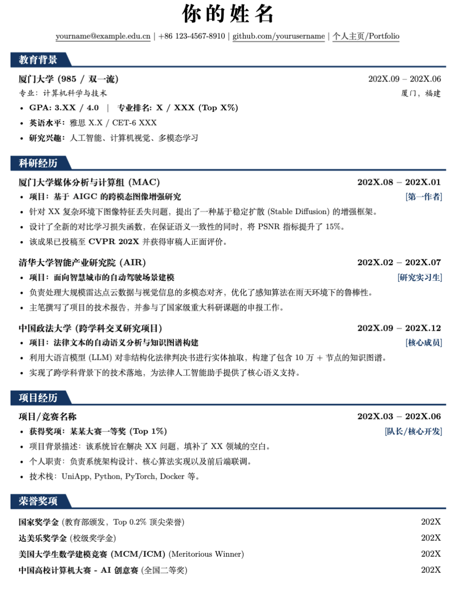

# 🚀 Modern Academic & Research CV Template 

**English** | [简体中文](./README_zh-CN.md)

[](https://opensource.org/licenses/MIT)
[](https://www.overleaf.com/)
[]()

A LaTeX resume template specifically designed for academic applications and job hunting. Its core feature is the **blue trapezoidal section header drawn with TikZ**, which gives the page a modern visual tension while maintaining a rigorous academic style.

---

## 📸 Preview

<p align="center">
  
</p>

---

## ✨ Key Features

- **💎 Unique Visual Design**: Utilizes TikZ vector graphics to define section headers, featuring a blue trapezoid and a horizontal extension line for a strong sense of hierarchy.
- **🌏 Excellent Bilingual Support**: Deeply customized based on the `ctex` package, perfectly solving Chinese character rendering and font alignment issues.
- **📑 Structured Macros**:
  - `\resumeResearchHeading`: Specially optimized for research/internship displays, supporting bi-directional alignment of "Project Name + Role/Identity".
  - `\resumeEducationHeading`: Clearly displays educational background and core courses.
- **🛠️ Cross-Disciplinary Applicability**: Although originally designed for CS students, its **high information density** and **modular** layout are equally suitable for economics, management, law, engineering, and other disciplines.
- **📏 Optimized Page Balance**: Pre-configured with reasonable vertical spacing and margins to ensure the page looks full when content is sparse, and automatically adapts when content is dense.

---

## 🚀 Quick Start

### 1. Requirements
This template must be compiled using the **XeLaTeX** engine to ensure proper display of Chinese fonts.

### 2. Usage in Overleaf
1. Create a new project and upload `main.tex`.
2. In the left menu **Menu** -> **Compiler**, select **XeLaTeX**.
3. Click **Recompile** to generate the PDF.

### 3. Local Compilation
Ensure you have a complete TeX Live or MiKTeX environment installed:
```bash
xelatex main.tex
```

---

## 🎨 Customization Guide

This template offers a high degree of freedom. You can easily customize your personal style by modifying the parameters at the top of `main.tex`:

#### 1. Theme Colors

- **Change Theme Color**: Locate `\definecolor{MyDarkBlue}{RGB}{0, 50, 100}`.
  - Want **Academic Dark Red**? Try: `{139, 0, 0}`
  - Want **Premium Pure Black**? Try: `{0, 0, 0}`
- **Trapezoid Width & Line Alignment**: In the `\titleformat{\section}` macro definition, modify `inner xsep=10pt` to adjust the width of the blue padding around the title text.
  - **⚠️ Important Note (When Changing Title Length)**: The horizontal line's starting offset `[xshift=-68.30pt]` is specifically calibrated for a **four-character Chinese title** (e.g., "教育背景"). If you change the number of characters in the title (such as using English words or fewer Chinese characters), the trapezoid width will change. You must adjust the `xshift` value in the `\draw` command accordingly (e.g., decrease its absolute value for shorter titles) to ensure the horizontal extension line connects seamlessly with the blue trapezoid without gaps or overlaps.

#### 2. Layout & Spacing

- **Overall Margins**: Modify the `\addtolength{\oddsidemargin}{-0.7in}` series of parameters.
  - **More content**: Decrease the value (e.g., `-0.8in`) to expand the writing area.
  - **Less content**: Increase the value (e.g., `-0.5in`) to make the page more compact.
- **Section Spacing**:
  - **Between Sections**: Modify `\titlespacing*{\section}{0pt}{12pt}{6pt}`. `12pt` is the top spacing, `6pt` is the bottom spacing.
  - **List Indentation**: Modify `leftmargin=0.15in` to adjust the indentation of the bulleted list from the left margin.
- **Fine-tuning Line Spacing**: Use `\vspace{-2pt}` within the list environment to refine the compactness between items.

#### 3. Fonts & Text

- **Letter Spacing**: The name section uses `\ziju{0.2}`. The larger the value, the more stretched the Chinese name will be. It is recommended to try between 0.1 and 0.5.
- **Font Style Guide**:
  - `\textbf{...}`: Bold, recommended for institution or award names.
  - `\textit{...}`: Italic, commonly used for dates or locations.
  - `\scshape`: Small caps, applied to the header name to highlight professionalism.

#### 4. Command Reference

The template comes with four core commands for easy invocation:

- `\resumeEducationHeading`: Dedicated for education experience, school on the left, time on the right.
- `\resumeResearchHeading`: **Recommended for research/projects**. Project name on the left, time on the right, supports inline `\hfill` for roles (e.g., `[First Author]`).
- `\resumeItem`: Standard bullet list item, with built-in fine-tuned spacing.
- `\resumeProjectHeading`: Simplified project/award item, suitable for single-line display.

---

## 📜 License

This repository is open-sourced under the **MIT License**. You are free to use, modify, and distribute it, but please retain the original author's attribution.

---

## 🤝 Contribution & Feedback

If you like this template, please give it a **Star** ⭐! If you have better layout improvement suggestions, feel free to submit a Pull Request or provide feedback via [Issues](https://github.com/RenxuLogan/Modern-Resume/issues).
